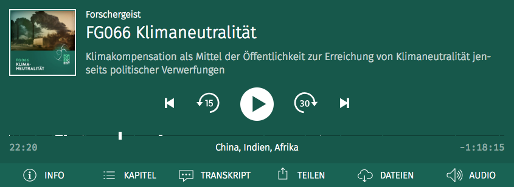
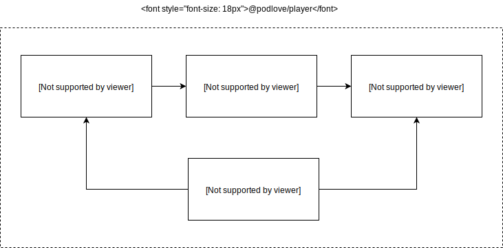

# Podlove Player

## About

HTML5 Goodness for Podcasting

**Podlove** Web Player is a Podcast-optimized, HTML5-based video and audio player.
It can be used as a WordPress plugin or within a static HTML/JavaScript context.

The **Podlove** Web Player supports almost every modern browser (Edge, Firefox, Chrome, Safari) and also does captions, chapters, transcripts and much more. 

* [Web Player Documentation](http://docs.podlove.org/podlove-web-player/)
* [Official site on podlove.org](http://podlove.org/podlove-web-player/)

## Used Technologies

- Package Manager: [npm](https://npmjs.org)
- Media Library: [Podlove Pure HTML5 Audio Driver](https://github.com/podlove/html5-audio-driver/)
- View Renderer: [VueJS](https://github.com/vuejs/vue)
- Bundler: [Webpack](https://github.com/webpack/webpack)
- State Management: [Redux](https://github.com/reactjs/redux) & [redux-vuex](https://github.com/alexander-heimbuch/redux-vuex#readme)

## Architecture

## Getting Started

### Development

1. Bootstrap the player package: `lerna bootstrap --hoist`
2. Run the development mode: `npm run dev`
3. Open your browser on `http://localhost:9000` to get started

### Building

1. Make sure that the dependencies are up to date: `lerna bootstrap --hoist`
2. Run the build step: `npm run build`
