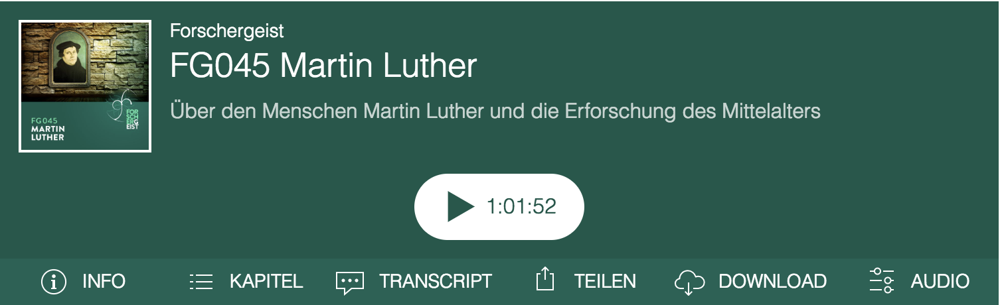

# Podlove Web Player

> Sandboxed Podlove Player Templates with the ability to embed and share episodes

## About

HTML5 Goodness for Podcasting

**Podlove** Web Player is a Podcast-optimized, HTML5-based video and audio player.
It can be used as a WordPress plugin or within a static HTML/JavaScript context.

The **Podlove** Web Player supports almost every modern browser (Edge, Firefox, Chrome, Safari) and also does captions, chapters, transcripts and much more. 

* [Web Player Documentation](http://docs.podlove.org/podlove-web-player/)
* [Official site on podlove.org](http://podlove.org/podlove-web-player/)

## Features

- Encapsulate Player in an iframe
- Provide a global function to bootstrap the embedded player
- Parse the provided configuration (resolving the root config, transcripts and chapters asynchroniously)
- Persist selected tabs and playtime to local storage
- Transform url parameters to player actions
- Forward the player api to the embedding page
- Provide additonal extensions for embedding page integration

## Architecture

## Getting Started

### Development

1. Bootstrap the web-player package: `lerna bootstrap --hoist`
2. Run the development mode: `npm run dev`
3. Open your browser on `http://localhost:9000` to get started

### Building

1. Make sure that the dependencies are up to date: `lerna bootstrap --hoist`
2. Run the build step: `npm run build`
