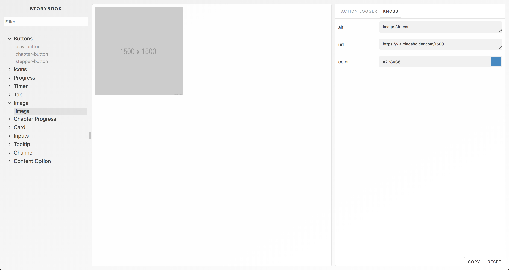

# Components

> Reusable representational Vue components

## Available Components

- Buttons: Play Button, Chapter, Stepper
- Card
- Channels (Social Media Channels)
- Icons
- Image (Lazy Loading Fade enabled)
- Inputs: Groups, Text, Slider, Select
- Tabs: Header and Body
- Tooltip
- Timers

## Getting Started

### Development

1. Bootstrap the components package: `lerna bootstrap --hoist`
2. Run the development mode: `npm run dev`
3. Open your browser on `http://localhost:6000` to get started

### Building

1. Make sure that the dependencies are up to date: `lerna bootstrap --hoist`
2. Run the build step: `npm run build`

## Development Philosophy

Components are meant to be used from different applications. They stick to the following principles:

- Are concerned with how things look
- Have no dependencies on the application state
- Don’t specify how the data is loaded or mutated
- Receive data via props, send data/actions via events
- Rarely have their own state (when they do, it’s UI state rather than data)
